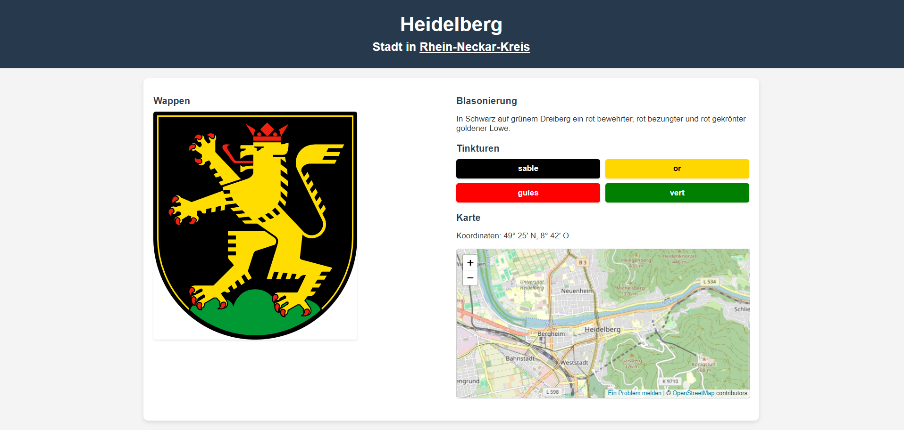
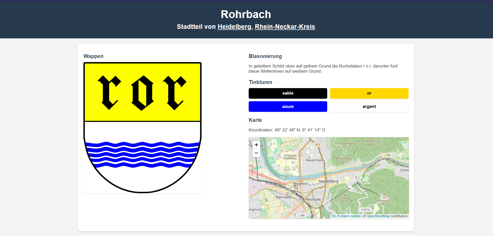
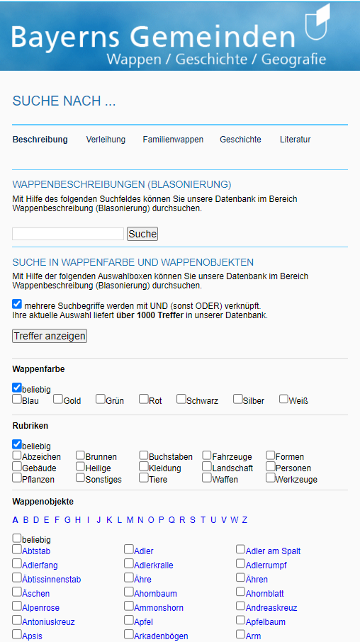
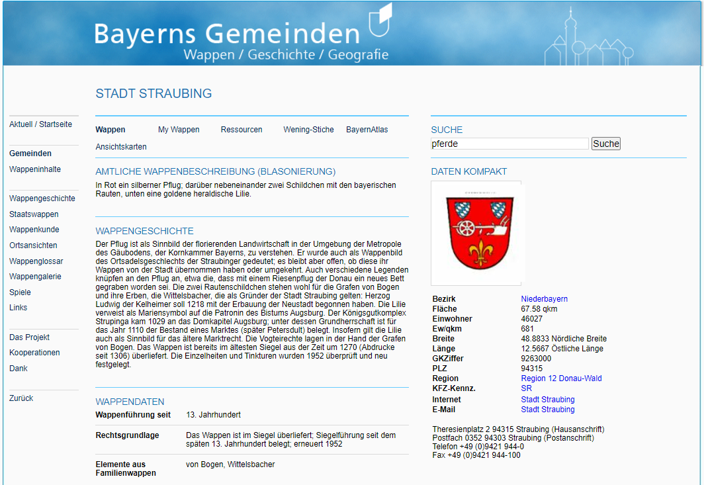

Egal ob eigenständige Gemeinde, Stadt oder eingemeindete Ortsteile: in Deutschland hat so ziemlich jede Siedlung ein eigenes Gemeindewappen. Auch wenn sie heutzutage immer mehr in Vergessenheit geraten, können uns Gemeindewappen viel über die Identität einer Siedlung erzählen: Da Gemeindewappen in erster Linie Repräsentationen von Orten sind, kann uns die Verwendung von Tinkturen (also Farben), Formen und Formen viel über die Außendarstellung eines Ortes verraten. 

Das Statistische Bundesamt zählt Stand September 2024 10.959 Gemeinden und Städte[^1]. Das war aber natürlich keineswegs immer so. 1950 waren es, also weit vor der großen Eingemeindungswelle an der Schwelle in die 1970er-Jahre[^2], 24.214 Gemeinden - und das nur in Westdeutschland[^3]. Addiert man dazu die ehemaligen Gemeinden Ostdeutschlands, Stadtteil- wie Landkreiswappen sowie Wappen von kleineren unselbstständigen Dörfern und Weilern, kommt man auf eine atemberaubende Zahl an Gemeindewappen, die so in ihrer Ganzheit noch nie in einer einheitlichen Datenbank erfasst wurden. 

Das Ziel dieses Projektes ist es, eine Datenbank aller Gemeindewappen in Deutschland zu erstellen. Ein großes Vorbild ist dabei die Wappendatenbank des Haus der Bayerischen Geschichte (HDBG), die für jedes Gemeindewappen ausführliche Informationen zu Blasionierung, Tinkturen und Wappengeschichte bereitstellt. Da jedoch die dort erhobenen Daten an den Grenzen des Freistaates enden, muss eine größere, breiter aufgestellte Datenbank für die ganze Bundesrepublik her. Diese wird, wie die bayerische, Daten zu Blasionierung (also einer heraldischen Beschreibung), Tinkturen (also der heraldischen Farbgebung) sowie auch - falls vorhanden - weiteren Informationen wie Wappengeschichte oder Jahr der Erstverwendung enthalten.

Die Daten werden mithilfe eines Datenbankmanagementsystems wie PostgreSQL oder MySQL gespeichert. Darauf greift eine Django-Instanz zu, welches eine dynamische Anpassung des HTML- und JavaScript-Quelltextes erlaubt. Ein wichtiges Element wird die Suche sein, denn alle auf dem Wappen enthaltenen Elemente werden mit Tags versehen und können so explizit gesucht werden. Dies gilt nicht nur für allgemeine heraldische Elemente, sondern auch für solche, die an eine ehemalige Zugehörigkeit erinnern (wie etwa die Stuttgarter Pferde[^4] oder die Mainzer Räder[^5]). Das gleiche gilt für die Tinkturen. Neben den heraldischen Informationen werden auch weitere Informationen zu der Gemeinde angeboten. Dazu zählen etwa eine Grafik, die die Bevölkerungsentwicklung anzeigt oder auch eine eingebundene OpenStreetMap-Karte. Bei größeren Gemeinden wird es außerdem eine Übersicht aller Ortsteile geben.

Doch woher kommen die Daten denn nun? Allgemeine Informationen zu den einzelnen Siedlungen werden aus der Normdatenbank *Wikidata bezogen*, auf deren Daten man mit einem SPARQL-Befehl zugreifen kann. Die Wappen selbst sind in den allermeisten Fällen als Vektordaten in WikiCommons zu finden, die von dort aus in die Datenbank eingebunden werden. Für die Tinkturen wird es ein Script geben, die die Farbzusammensetzungen der Vektordateien analysiert. Informationen wie Blasionierung und Wappengeschichte lassen sich zumindest teilweise über seriöse Anbieter wie dem HDBG hinzuziehen, die dann entsprechend referenziert werden. Für Lücken muss aber heraldische Fachliteratur zu Rate gezogen werden. Denkbar wäre in diesem Kontext das Analysieren der doch schematischen Abbildungen auf den Wappen mithilfe von Image Processing-Tools. 

Die Gemeindewappen-Datenbank hat letztlich nicht nur das Ziel, eine zentrale Datenbank für alle Gemeindewappen Deutschlands (und eventuell auch darüber hinaus) zu schaffen, sondern auch ein einsteigerfreundliches Werkzeug bereitstellen, um die bunte und vielfältige Welt der Gemeindeheraldik für alle zugänglich zu machen.

503 Wörter

|Erster Entwurf zweier Einträge||
|-|-|
|||

|Zum Vergleich: Wappendatenbank des HDBG||
|-|-|
|||

[^1]: Gemeindeverzeichnis-Informationssystem GV-ISys, in: Statistische Ämter des Bundes und der Länder, online: https://www.destatis.de/DE/Themen/Laender-Regionen/Regionales/Gemeindeverzeichnis/_inhalt.html [27.11.2024].
[^2]: Beispielsweise wurden in Baden-Württemberg durch das *Besondere Gemeindereformgesetz vom 9. Juli 1975* die Anzahl der Kommunen von 3.379 auf 1.111 gedrittelt, vgl. Brachat-Schwart, Werner: 50 Jahre Gemeindereform in Baden-Württemberg. Wie wurde die Reform in den einzelnen Landesteilen umgesetzt und wie haben sich die »neuen« Kommunen seither entwickelt?, in: Statistisches Monatsheft 6+7 (2024), S. 16.
[^2]: Beispielsweise wurden in Baden-Württemberg durch das *Besondere Gemeindereformgesetz vom 9. Juli 1975* die Anzahl der Kommunen von 3.379 auf 1.111 gedrittelt, vgl. Brachat-Schwart, Werner: 50 Jahre Gemeindereform in Baden-Württemberg. Wie wurde die Reform in den einzelnen Landesteilen umgesetzt und wie haben sich die »neuen« Kommunen seither entwickelt?, in: Statistisches Monatsheft 6+7 (2024), S. 16.
[^3]: Alle politisch selbständigen Gemeinden am 31.12.1950, in: Statistische Ämter des Bundes und der Länder, online: https://www.destatis.de/DE/Themen/Laender-Regionen/Regionales/Gemeindeverzeichnis/Administrativ/Archiv/GVAuszugJ/31121950_Auszug_GV.html [27.11.2024].
[^4]: wie etwa Stuttgart, vgl. Wappen von Stuttgart, in: Leo.BW, online: https://www.leo-bw.de/web/guest/detail/-/Detail/details/DOKUMENT/labw_wappen/5/Wappen+von+Stuttgart [27.11.2024].
[^5]: wie etwa Mainz, vgl. Das Mainzer Stadtwappen, in: Landeshauptstadt Mainz, online: https://www.mainz.de/kultur-und-wissenschaft/stadtgeschichte/stadtwappen.php [27.11.2024].

